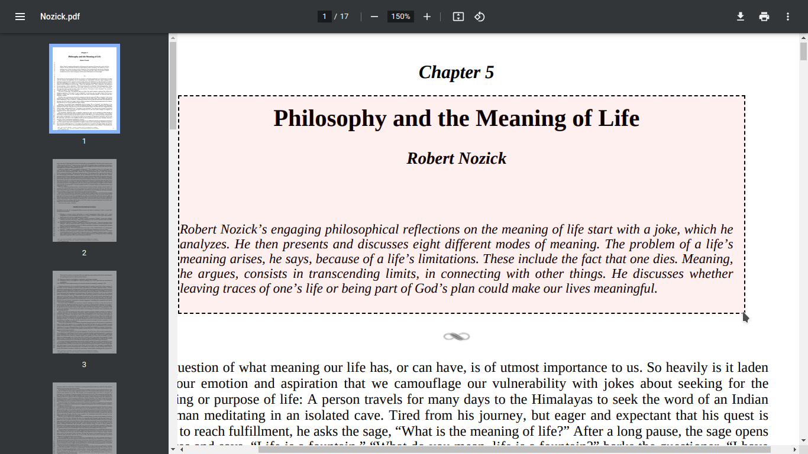
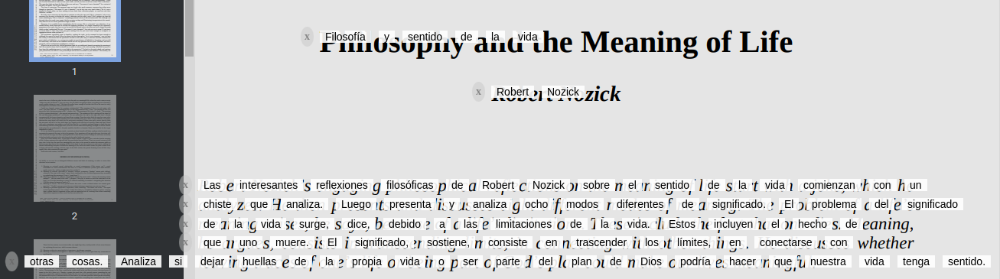

# EXTension1 Manual de Uso

## Instrucciones paso a paso

### 1. Logo de la Extensión

### 2. Selección del Idioma y API Key
Para comenzar, selecciona el idioma al que deseas traducir. Además, es fundamental que ingreses tu API key de Google para permitir la traducción de idioma.

### 3. Selecciona el Texto a Traducir
A continuación, selecciona el texto que deseas traducir.
Selecciona de izquierda a derecha y de arriba a abajo; de lo contrario, no funcionará.

### 4. Resultado de la Traducción
Tras completar los pasos anteriores, verás el resultado de la traducción.

### 5. Uso de la Extensión para Guardar la API Key
Para evitar ingresar constantemente tu API key, haz clic derecho y selecciona el icono de la extensión que dice "translate". De esta manera, solo necesitarás seleccionar el área de texto a traducir.

### 3. Ajuste del Texto Traducido en Pantalla
Mover en Eje X: Utiliza el primer botón para desplazar el texto en el eje horizontal.  
Mover en Eje Y: Usa el segundo botón para mover el texto verticalmente.  
Fondo Blanco Extendido: Con el tercer botón, puedes agregar un fondo blanco más grande detrás del texto para mejorar su visibilidad.  
Separación de Letras: El cuarto botón te permite ajustar el espacio entre las palabras del texto.  
Tamaño de Letra: Con el quinto botón, puedes incrementar el tamaño de la letra.  
Espaciado Interlineado: El último botón ajusta el espacio entre las líneas del texto.  
El boton de reset restablece los parametros a cero.  

---

Esperamos que este manual te sea útil y disfrutes usando EXTension1.

## Tecnologías Utilizadas

Esta extensión utiliza [Tesseract.js](https://github.com/naptha/tesseract.js/tree/master) para detectar y extraer texto. Agradecemos a los creadores y contribuyentes de Tesseract.js por su excelente trabajo. Puedes encontrar el proyecto original y contribuir en su [repositorio de GitHub](https://github.com/naptha/tesseract.js/tree/master).
